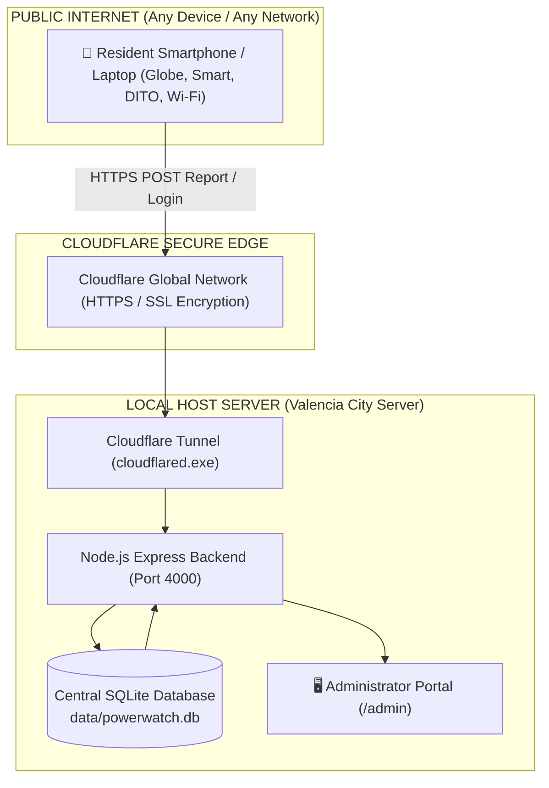

# Valencia PowerWatch: Complete Deployment & Operations Manual
**Community Power Interruption Reporting, Verification, and Information Management System**
*Valencia City, Bukidnon*

---

## 1. Executive Summary & Live Access Links

Valencia PowerWatch is a centralized, real-time power outage monitoring and verification platform designed for Valencia City, Bukidnon. It connects residents reporting local outages directly with utility administrators and emergency dispatchers.

### 🌐 Current Active Online Links (Accessible Worldwide)
* **📱 Community / Resident Portal (Public):**  
  👉 `https://results-layers-configuring-albany.trycloudflare.com/community`  
  *(Works on smartphones, tablets, laptops across Smart, Globe, DITO, and all Wi-Fi networks)*
* **🛡️ Administrator Portal (Secured & Restricted):**  
  👉 `https://results-layers-configuring-albany.trycloudflare.com/admin`  
  *(Protected by role-based access control. Resident logins are blocked and redirected)*
* **🩺 API Health Check:**  
  👉 `https://results-layers-configuring-albany.trycloudflare.com/api/health`

---

## 2. Test Credentials

| Role | Portal URL | Email | Password | Access Level |
| :--- | :--- | :--- | :--- | :--- |
| **Residente (Community)** | `/community` | `resident@test.com` *(or Register new)* | `password123` | Report power outages, view map & announcements |
| **System Administrator** | `/admin` | `admin@valencia.gov.ph` | `Admin@123` | Full control: verify reports, GIS heatmaps, manage incidents |
| **Utility Engineer** | `/admin` | `engineer@valencia.gov.ph` | `Engineer@123` | Outage clustering, technical verification |

---

## 3. End-to-End System Architecture

### Key Integration Principles:
1. **Centralized Database Synchronization:** Every account created and every power outage reported from any smartphone immediately writes to the central SQLite database (`data/powerwatch.db`).
2. **Instant Admin Visibility:** When an administrator opens the Admin Portal, all community reports appear instantly with timestamps, barangay locations, and map coordinates.
3. **Role-Based Security:** Resident accounts trying to access the `/admin` route are automatically rejected with `"Access restricted. Resident accounts cannot access the Administrator Portal"` and redirected back to `/community`.

---

## 4. Step-by-Step Operations Guide

### A. Resident / Community User Walkthrough
1. **Open Portal:** Navigate to `/community` on any phone browser.
2. **Account Registration / Login:**
   - Click **Register** to create a personal account (Name, Contact Number, Barangay, Email, Password).
   - Or log in with `resident@test.com` / `password123`.
3. **Submitting a Power Outage Report:**
   - Tap **"Report Outage"**.
   - Select your Barangay (e.g., Poblacion, Bagontaas, Mailag, Batangan, etc.).
   - Pinpoint your exact location on the interactive Leaflet GPS Map.
   - Choose outage type (Complete Blackout, Partial Voltage/Flicker, Line Down/Transformer Spark).
   - Optional: Attach a photo or notes.
   - Tap **"Submit Report"**.
4. **Connectivity:** Report submission requires an active internet connection. If the connection drops, reconnect before submitting; reports are not currently saved to an offline queue.

### B. Administrator Walkthrough
1. **Login:** Navigate to `/admin` and enter administrator credentials.
2. **Real-time Incident Monitoring:**
   - View incoming reports on the live dispatch board.
   - Filter by Barangay, status (Pending, Verified, Dispatched, Resolved), or severity.
3. **Outage Heatmap & Smart Clustering:**
   - Open the **GIS Map** tab.
   - Toggle the **Heatmap Layer** to see outage density across Valencia City.
   - Use **Cluster Analysis** to detect transformer-level or feeder-level multi-household blackouts.
4. **Broadcast Emergency Advisories:**
   - Post scheduled maintenance announcements or emergency typhoon advisories that immediately appear on all resident phones.
5. **Printable Incident Reports:**
   - Click **"Generate Official Incident Report"** to export printable, audit-ready PDF documents for utility records and city hall archives.

---

## 5. Maintenance & Startup Procedures

If the computer is restarted or turned off, follow these simple steps:

### 1-Click Startup:
1. Open the project folder on your computer.
2. Double-click **`start-public-online.bat`**.
3. A console window will open, verify the local backend, connect to Cloudflare, print the new public HTTPS link, copy it to your clipboard, and automatically launch Google Chrome!
4. Keep the black console window open while using or demonstrating the system.
